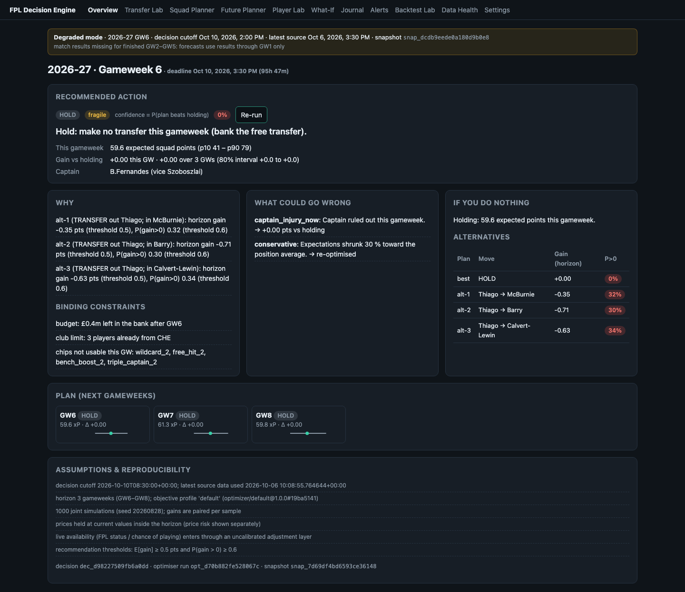
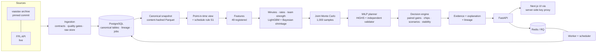

# FPL Decision Engine

[](https://github.com/adivishall/FPL/actions/workflows/ci.yml)

An uncertainty-aware decision engine for Fantasy Premier League. It starts from a manager's real
squad, forecasts each player's minutes and **point distribution**, searches legal transfer and
chip paths over several gameweeks with a mixed-integer program, compares every plan against
**doing nothing**, stress-tests the choice, and explains it from stored evidence — with every
recommendation traceable back to the exact data snapshot, model versions and source revision.



It is evaluated the way it would be used: replayed week by week through three historical seasons
with only the information available before each deadline, against six benchmark strategies.

## What is different from a typical FPL optimiser

| Typical optimiser | This project |
|---|---|
| One expected-points number per player | Joint Monte Carlo distributions (shared match outcomes, minutes, bonus) per player × gameweek |
| "Best transfer" every week | HOLD / TRANSFER / HIT / CHIP decided by *paired* simulated gain vs holding, with thresholds |
| Re-optimises from scratch | Multi-gameweek MILP over the real state: bank, purchase prices, selling-price rule, banked free transfers, two chip sets, Free Hit reversion |
| Backtest on final data | Point-in-time data model; schedule as *published* at each cutoff; future-perturbation tests |
| Opaque output | Evidence-based explanations, downside scenarios, a "what if you do nothing" counterfactual, and a lineage trace |

## Architecture



Deployed with Docker Compose: `postgres`, `redis`, `migrate`, `api`, `worker`, `scheduler`,
`web` (+ optional `prometheus`). The browser only talks to the web server, which proxies
`/backend/*` to the API and holds the API key; the worker computes forecasts, recommendations,
alert evaluations and backtests; the scheduler refreshes live data hourly and the API promotes a
new snapshot only once its forecast is precomputed. Architecture decisions: `docs/decisions/`.

## Data pipeline

Raw payloads are stored content-addressed; each canonical row records the payload it came from;
every observation carries an *availability* timestamp separate from its event time (ADR-0004).
The canonical snapshot id is a hash of all tables — rebuilding from the pinned historical commit
gives `snap_b64560a8c4f434ad984e` on macOS and inside the Linux container alike. Live captures
from the official API (prices, availability, news, fixtures, deadlines) produce new snapshots;
historical evaluation is pinned to the archive snapshot and never sees them.

**Schedule rule S1.** Archives contain only the *final* fixture list, so a match postponed on the
day looks "known" months earlier. The point-in-time view reconstructs each moved fixture's
original round (an exact, uniqueness-checked assignment over the double round-robin) and shows
the schedule as it was published at every cutoff. Finding and fixing this look-ahead invalidated
the project's earlier backtest numbers; the report shows what changed.

## Forecasting

Expected minutes and start probability (calibrated LightGBM), per-90 attacking and defensive
rates with Bühlmann–Straub shrinkage to position/price priors, and a recency-weighted team
strength model feed a **joint simulation**: goals, assists, clean sheets, saves, defensive
contributions, cards and bonus are sampled per fixture with shared randomness, then scored with
the versioned rules of each season. Out of sample over 114 weekly cutoffs
(`ml/reports/forecast_eval.md`):

| | MC model | best simple baseline | climatology |
|---|---|---|---|
| RMSE, points (h0) | **1.924** | 2.031 (CI of difference excludes 0) | 2.351 |
| CRPS | **0.628** | — | 0.722 |
| Randomised-PIT 80 % coverage | **0.804** | — | — |
| P(start) Brier / ECE | **0.083 / 0.011** | 0.101 / 0.021 | — |

Pre-registered promotion gates pass; one gate was redefined after seeing results and is recorded
as such in the model card (`docs/MODEL_CARD.md`).

## Optimisation and decisions

A MILP (HiGHS, `mip_rel_gap` 0) plans 1–8 gameweeks (configurable cap): squad composition, budget with exact
selling prices, free-transfer banking (up to 5), hits, both chip sets with their windows, Free
Hit reversion, captain/vice and bench order. Every returned plan is replayed through the domain
state machine by an independent validator. The decision engine compares the best plan, HOLD and
alternatives on the *same* simulated samples and only recommends a move that clears a minimum
expected gain and a probability of beating HOLD; a chip planner values each chip now versus
waiting; scenarios (minutes shocks, injuries, team attack, postponements, price moves) stress
the choice; a replacement picker rebuilds the whole squad for a chosen outgoing player.
Optimiser benchmark on realistic workloads (`ml/reports/optimizer_benchmark.md`; 612 solves plus 48
HOLD-and-alternatives runs on 48 real squad states across three seasons, single-threaded HiGHS on an Apple M4):

| | result |
|---|---|
| Returned plans passing independent validation | 100 % (634 checked) |
| Transfer plan, 5 GW / 8 GW | p50 3.9 s, p95 13.4 s / p50 16.0 s, p95 43.5 s (1 of 36 hit the 60 s limit) |
| HOLD + 3 alternatives, 5 GW | p50 24.9 s, p95 70.5 s |
| MILP vs greedy one-transfer heuristic (same objective) | higher in 94 % of states; p50 +5.5, max +97 points |
| Candidate pool vs full player universe | 0.000 points lost in 24 of 24 states |
| Identical re-solve | same action and objective in 100 % |
| Chip-open (all usable chips, 5 GW) | **always hits the 60 s limit** (48/48): validated incumbent, no optimality proof |

## Walk-forward backtest (three seasons, 114 gameweeks)

Every strategy starts each season from the same squad and is replayed through all 38 gameweeks
with actual FPL scoring, automatic substitutions and hits (`ml/reports/backtest.md`,
protocol `docs/BACKTEST_PROTOCOL.md`). Engine minus benchmark, total over 114 gameweeks, 95 %
season-stratified bootstrap CI:

| vs | difference | 95 % CI | reading |
|---|---|---|---|
| `hold` (never transfer) | +1905 | [+1454, +2381] | better |
| `form` | +742 | [+391, +1076] | better |
| `fpl_style_heuristic` | +732 | [+369, +1094] | better |
| `simple_xp` | +626 | [+311, +956] | better |
| `engine_no_chips` | +306 | [+28, +593] | better, barely (value of chip timing) |
| `single_gw_mc` (same forecast, 1-week optimiser) | +223 | [−126, +584] | **inconclusive** |

Per season the picture is weaker: in 2023-24 the engine scored **73 points less** than
`single_gw_mc` (CI includes 0), and 10 of the 15 single-season comparisons against benchmarks
other than `hold` are inconclusive. In 2024-25 the engine is ahead of `form` (+210 [+45, +363])
and `fpl_style_heuristic` (+195 [+30, +350]); against `single_gw_mc` (+135 [−72, +347]) and
`engine_no_chips` (+109 [−51, +273]) it is inconclusive; removing the schedule leak turned the
earlier "better than `simple_xp`" into inconclusive (+140 [−26, +304]) and the earlier
inconclusive result against `hold` into better (+543 [+263, +813]). The
evidence supports "probabilistic forecasting + optimisation beats simple heuristics"; it does
**not** show that multi-gameweek planning beats a one-week optimiser on the same forecast. All
decisions were legal (100 %), with zero look-ahead violations. Re-running the replays after the
last optimiser fix reproduced 11 of 21 strategy-seasons decision-for-decision; the other 10
diverge only from GW34 on, where that fix (no value for transfers banked past GW38) applies. No rank claims: the archive has no distribution of other managers' scores.

## Alerts, explanations and traceability

Alerts (§74) fire only above materiality thresholds and deduplicate by state: deadline reminders
in the manager's time zone, availability and role changes, unexpected benching, the probability
that price moves make a planned transfer unaffordable, fixture changes inside the plan horizon,
recommendation invalidation and a post-gameweek review — replayed on real data in
`ml/reports/alerts_audit.md`. Every recommendation can be walked back
recommendation → optimisation run → prediction run → feature snapshot → data snapshot → pinned
source revision, with integrity checks (`GET /api/v1/recommendations/{id}/trace`).

## Testing

Measured on the final code (`docs/BUILD_STATUS.md`):

| Suite | Result |
|---|---|
| Python fast tier — unit, Hypothesis property tests, integration on real PostgreSQL and Redis | 374 passed, 0 failed, 0 skipped |
| Slow tier — official points reproduced on all 113,870 historical player-match rows | 2 passed |
| Network tier — versioned 2026-27 ruleset vs the live FPL API's own game settings | 3 passed |
| Playwright, production topology — browser → Next.js proxy → API key → API → PostgreSQL / Redis / worker, on the Docker Compose stack | 17 passed |
| Playwright, development flows | 7 passed |
| ruff, mypy (109 files), import-linter (4 layering contracts), `tsc` | clean |

The production suite covers key enforcement (missing / invalid / valid), that the proxy key never
reaches the browser, squad build, captain / vice / bench, worker-generated recommendations,
price predictions, replacement → what-if without mutating state, alert de-duplication,
time-zone and webhook validation, traceability, export and erasure, the Backtest Lab, API error /
auth / outage states and rate limiting. GitHub Actions runs lint, types, tests, the optimiser
suite, e2e, dependency and secret scans and container builds on every push.

## Deployment and operations

`docker compose up -d` runs PostgreSQL, Redis, migrations, the API, the RQ worker, the
scheduler and the web server (+ Prometheus with `--profile monitoring`); verified locally with
health checks for every service, persistence across restarts and recovery from a killed worker
(`docs/DEPLOYMENT.md`). The scheduler captures live data hourly, precomputes forecasts (the API
promotes a new snapshot only once its forecast is ready), evaluates alerts and prunes old
snapshots and caches. Failed jobs are classified as code `error` or environmental `interrupted`
(killed, lost, timed out); results are published atomically, so an interrupted job leaves
nothing partial and is simply re-run.

Security model: hashed API keys (constant-time check) on every write and every manager-linked
read; the browser never sees a key (server-side proxy); token-bucket rate limits; SSRF-guarded
webhooks (HTTPS, host allow-list, public addresses only, no redirects); export and erasure of
all manager data; audit log and application logs hold only hashes of keys. It is a
**single-tenant** design for a personal or trusted-group deployment (KNOWN_LIMITATIONS §6).

## Running it

```bash
uv sync --frozen && make ci                     # Python 3.12 workspace, all checks
infra/scripts/dev_postgres.sh start             # local PostgreSQL (or docker compose up -d postgres redis)
uv run fpl-ingest historical --all && uv run fpl-ingest export-snapshot
uv run python ml/experiments/backtest.py        # three seasons (resumable; ~1 h in parallel)
cp .env.example .env                            # set keys/passwords, then:
docker compose up -d                            # full stack on :3000 (web) / :8000 (API)
```

Serving performance on one development machine (`ml/reports/performance.md`, Apple M4):

| | measured |
|---|---|
| Deployed reads through the web proxy (p50 / p95) | 22 / 25 ms (`/gameweeks/current`), 42 / 45 ms (`/players`), 37 / 41 ms (player forecast) |
| Forecast, cold (train + 667 players × 8 GW × 1,000 samples) / warm disk / warm memory | 71.8 s / 0.03 s / 0.06 ms |
| Replacement picker (1 player, 5 GW) / what-if (1 scenario) | p50 17.7 s / 8.1 s |
| Full recommendation (alternatives, stability, scenarios, chips; worker job) | 48 s at 3 GW deployed; 136–178 s at 5 GW in-process, by profile |
| Alert evaluation job round trip via RQ worker | 1.6 s |

Recommendations therefore run as background jobs; heavy requests are minutes, not milliseconds.

## Status and limitations

Specification audit: `docs/FINAL_AUDIT.md` (99 requirements: 79 COMPLETE, 15 PARTIAL, 4 NOT IMPLEMENTED, 0 BLOCKED, 1 NOT VERIFIABLE). What is not done or not proven —
including that live per-match results are not yet ingested from the API, the single-tenant
security model, selection bias from developing on the evaluated seasons, and development-machine
timings — is in `docs/KNOWN_LIMITATIONS.md`. Progress record: `docs/BUILD_STATUS.md`.
