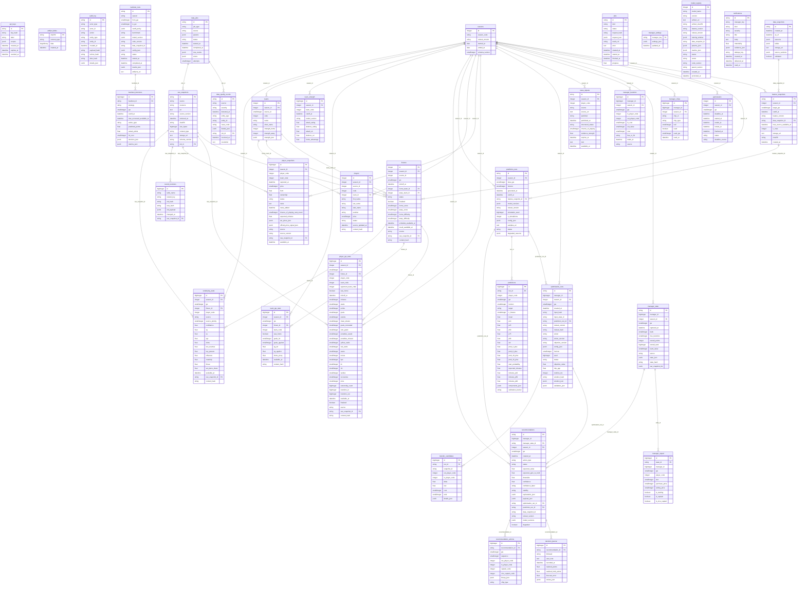

# Database schema

Generated by `infra/scripts/schema_diagram.py` from `fpl_storage.models` (37 tables). Do not edit by hand.

```mermaid
erDiagram
  api_keys {
    string id PK
    string key_hash
    string label
    jsonb scopes
    datetime created_at
    datetime expires_at
    datetime revoked_at
  }
  artifact_blobs {
    string sha256 PK
    string content_type
    largebinary data
    datetime created_at
  }
  audit_log {
    string id PK
    string actor_type
    string actor_id
    string action
    string entity_type
    string entity_id
    datetime created_at
    string payload_hash
    string before_hash
    string after_hash
    jsonb details_json
  }
  backtest_decisions {
    biginteger id PK
    string backtest_id FK
    string strategy
    smallinteger gw
    datetime cutoff_at
    datetime max_accessed_available_at
    string action_type
    float predicted_points
    float actual_points
    smallinteger hit_cost
    jsonb decision_json
    jsonb metrics_json
  }
  backtest_runs {
    string id PK
    string season
    smallinteger from_gw
    smallinteger to_gw
    jsonb cutoff_policy
    string benchmark
    jsonb model_version
    string code_version
    string data_snapshot_id
    jsonb config_json
    string status
    datetime started_at
    datetime completed_at
    jsonb results_json
    text artifacts_uri
  }
  data_jobs {
    string id PK
    string job_type
    string source
    jsonb params
    string status
    datetime started_at
    datetime completed_at
    jsonb row_counts
    jsonb errors
    smallinteger attempts
  }
  data_quality_events {
    string id PK
    string source
    string severity
    datetime detected_at
    string entity_type
    string entity_id
    string issue_code
    jsonb details_json
    string job_id FK
    datetime resolved_at
    text resolution
  }
  data_snapshots {
    string id PK
    datetime created_at
    datetime as_of
    jsonb seasons
    jsonb tables
    text storage_uri
    jsonb source_versions
    boolean validated
  }
  decision_journal {
    biginteger id PK
    string recommendation_id FK
    string followed
    text user_note
    datetime recorded_at
    float realized_points
    float realized_hold_points
    float forecast_error
    jsonb review_json
  }
  feature_snapshots {
    string id PK
    integer season_id FK
    smallinteger target_gw
    datetime cutoff_at
    string feature_version
    string data_snapshot_id FK
    datetime max_source_available_at
    integer n_rows
    text storage_uri
    string sha256
    datetime created_at
  }
  fixtures {
    integer id PK
    integer season_id FK
    integer source_id
    smallinteger gw
    datetime kickoff_at
    integer home_team_id FK
    integer away_team_id FK
    string status
    boolean finalized
    smallinteger home_score
    smallinteger away_score
    smallinteger home_difficulty
    smallinteger away_difficulty
    datetime schedule_available_at
    datetime result_available_at
    string source
    string raw_snapshot_id FK
    string content_hash
  }
  gameweeks {
    integer id PK
    integer season_id FK
    smallinteger gw
    datetime deadline_at
    datetime started_at
    datetime ended_at
    datetime locked_at
    datetime finalized_at
    string status
    string deadline_source
  }
  jobs {
    string id PK
    string kind
    string status
    string request_hash
    jsonb request_json
    string result_ref
    text error
    datetime created_at
    datetime started_at
    datetime finished_at
    float progress
  }
  manager_chips {
    biginteger id PK
    biginteger manager_id
    integer season_id FK
    string chip_id
    string chip_type
    smallinteger half
    boolean used
    smallinteger used_gw
    datetime used_at
  }
  manager_settings {
    string manager_key PK
    jsonb settings_json
    datetime updated_at
  }
  manager_squad {
    biginteger id PK
    string state_id FK
    biginteger manager_id
    smallinteger gw
    integer player_code
    smallinteger slot
    smallinteger purchase_price
    smallinteger selling_price
    boolean is_starting
    boolean is_captain
    boolean is_vice_captain
  }
  manager_state {
    string id PK
    biginteger manager_id
    integer season_id FK
    smallinteger gw
    datetime captured_at
    smallinteger bank
    smallinteger free_transfers
    integer overall_points
    biginteger overall_rank
    smallinteger team_value
    string source
    jsonb state_json
    string state_hash
    jsonb raw_snapshot_ids
  }
  manager_transfers {
    biginteger id PK
    biginteger manager_id
    integer season_id FK
    smallinteger gw
    integer in_player_code
    integer out_player_code
    smallinteger in_cost
    smallinteger out_value
    smallinteger cost
    string free_or_hit
    datetime made_at
    string source
  }
  model_registry {
    integer id PK
    string model_name
    string version
    text artifact_uri
    string artifact_sha256
    string feature_version
    string ruleset_version
    jsonb training_window
    string data_snapshot_id
    jsonb params_json
    jsonb metrics_json
    string status
    string owner
    string code_version
    string parent_version
    datetime created_at
    datetime promoted_at
  }
  news_signals {
    string id PK
    integer season_id FK
    integer player_code
    string source
    text source_url
    string publisher
    datetime published_at
    string structured_status
    smallinteger chance_of_playing
    float evidence_strength
    datetime expires_at
    text text
    datetime available_at
  }
  notifications {
    string id PK
    string manager_key
    string kind
    string severity
    string title
    text body
    float materiality
    jsonb evidence_json
    string dedupe_key
    datetime created_at
    datetime delivered_at
    datetime read_at
  }
  optimization_runs {
    string id PK
    biginteger manager_id
    integer season_id FK
    smallinteger gw
    datetime created_at
    string input_hash
    string input_state_id
    string prediction_run_id FK
    string ruleset_version
    string ruleset_hash
    string solver
    string solver_version
    string objective_version
    jsonb config_json
    smallinteger horizon
    biginteger seed
    string status
    float objective_value
    float mip_gap
    integer runtime_ms
    string solution_hash
    jsonb solution_json
    jsonb validation_json
  }
  player_gw_stats {
    biginteger id PK
    integer season_id FK
    smallinteger gw
    integer fixture_id FK
    integer player_code
    integer team_code
    integer opponent_team_code
    boolean was_home
    datetime kickoff_at
    smallinteger minutes
    smallinteger starts
    smallinteger points
    smallinteger goals
    smallinteger assists
    smallinteger clean_sheets
    smallinteger goals_conceded
    smallinteger own_goals
    smallinteger penalties_saved
    smallinteger penalties_missed
    smallinteger yellow_cards
    smallinteger red_cards
    smallinteger saves
    smallinteger bonus
    smallinteger bps
    smallinteger dc
    smallinteger cbi
    smallinteger tackles
    smallinteger recoveries
    smallinteger price
    biginteger ownership_count
    biginteger transfers_in
    biginteger transfers_out
    datetime available_at
    boolean finalized
    string source
    string raw_snapshot_id FK
    string content_hash
  }
  player_snapshots {
    biginteger id PK
    integer season_id FK
    integer player_code
    integer team_code
    datetime captured_at
    smallinteger price
    float form
    float ownership
    string status
    text news
    datetime news_added
    smallinteger chance_of_playing_next_round
    float expected_minutes
    jsonb set_piece_json
    jsonb official_price_signal_json
    string source
    string source_version
    string raw_snapshot_id FK
    datetime available_at
  }
  players {
    integer id PK
    integer season_id FK
    integer source_id
    integer code
    integer team_id FK
    string first_name
    string last_name
    string web_name
    string position
    smallinteger price
    string status
    datetime source_updated_at
    string content_hash
  }
  prediction_runs {
    string id PK
    integer season_id FK
    smallinteger base_gw
    smallinteger horizon
    datetime generated_at
    datetime cutoff_at
    string feature_snapshot_id FK
    jsonb model_versions
    string ruleset_version
    biginteger simulation_seed
    integer n_simulations
    jsonb config_json
    text samples_uri
    string status
    jsonb degraded_reasons
  }
  predictions {
    biginteger id PK
    string run_id FK
    integer player_code
    smallinteger gw
    smallinteger horizon
    string target
    smallinteger n_fixtures
    float mean
    float p10
    float p25
    float p50
    float p75
    float p90
    float std
    float prob_2_plus
    float prob_6_plus
    float prob_10_plus
    float prob_15_plus
    float start_probability
    float expected_minutes
    float minutes_p10
    float minutes_p50
    float minutes_p90
    jsonb components_json
    string calibration_bucket
  }
  raw_snapshots {
    string id PK
    string source
    string resource
    text url
    string source_version
    datetime retrieved_at
    string sha256
    biginteger size_bytes
    string content_type
    text storage_uri
    string schema_version
    string job_id FK
  }
  recommendation_actions {
    biginteger id PK
    string recommendation_id FK
    smallinteger gw
    smallinteger sequence
    integer out_player_code
    integer in_player_code
    integer captain_code
    integer vice_captain_code
    jsonb lineup_json
    string chip_type
  }
  recommendations {
    string id PK
    biginteger manager_id
    string manager_state_id FK
    integer season_id FK
    smallinteger gw
    datetime created_at
    string action_type
    string status
    float expected_value
    float expected_gain_vs_hold
    float downside
    float confidence
    string confidence_label
    string stability
    jsonb explanation_json
    jsonb payload_json
    string optimization_run_id FK
    string prediction_run_id FK
    string data_snapshot_id
    string ruleset_version
    jsonb model_versions
    boolean degraded
  }
  record_revisions {
    biginteger id PK
    string table_name
    string natural_key
    string old_hash
    string new_hash
    jsonb old_payload
    datetime changed_at
    string raw_snapshot_id FK
  }
  seasons {
    integer id PK
    string season_code
    string ruleset_version
    date started_at
    date ended_at
    smallinteger schema_version
  }
  team_gw_stats {
    biginteger id PK
    integer season_id FK
    smallinteger gw
    integer fixture_id FK
    integer team_code
    boolean was_home
    smallinteger goals_for
    smallinteger goals_against
    float xg_for
    float xg_against
    float shots_proxy
    datetime available_at
    string content_hash
  }
  team_strength {
    biginteger id PK
    integer season_id FK
    integer team_code
    datetime cutoff_at
    string model_version
    float attack_rating
    float defence_rating
    float attack_sd
    float defence_sd
    float home_advantage
  }
  teams {
    integer id PK
    integer season_id FK
    smallinteger source_id
    integer code
    string name
    string short_name
    integer strength_home
    integer strength_away
    jsonb strength_json
  }
  transfer_candidates {
    biginteger id PK
    string run_id FK
    string snapshot_id
    integer out_player_code
    integer in_player_code
    float delta
    float risk
    smallinteger cost
    smallinteger rank
    jsonb details_json
  }
  underlying_stats {
    biginteger id PK
    integer season_id FK
    smallinteger gw
    integer fixture_id FK
    integer player_code
    string source
    smallinteger source_priority
    float confidence
    float xg
    float xa
    float xgc
    float shots
    float box_touches
    float key_passes
    float influence
    float creativity
    float threat
    float set_piece_share
    datetime available_at
    string raw_snapshot_id FK
    string content_hash
  }
  backtest_runs ||--o{ backtest_decisions : "backtest_id"
  data_jobs ||--o{ data_quality_events : "job_id"
  data_jobs ||--o{ raw_snapshots : "job_id"
  data_snapshots ||--o{ feature_snapshots : "data_snapshot_id"
  feature_snapshots ||--o{ prediction_runs : "feature_snapshot_id"
  fixtures ||--o{ player_gw_stats : "fixture_id"
  fixtures ||--o{ team_gw_stats : "fixture_id"
  fixtures ||--o{ underlying_stats : "fixture_id"
  manager_state ||--o{ manager_squad : "state_id"
  manager_state ||--o{ recommendations : "manager_state_id"
  optimization_runs ||--o{ recommendations : "optimization_run_id"
  optimization_runs ||--o{ transfer_candidates : "run_id"
  prediction_runs ||--o{ optimization_runs : "prediction_run_id"
  prediction_runs ||--o{ predictions : "run_id"
  prediction_runs ||--o{ recommendations : "prediction_run_id"
  raw_snapshots ||--o{ fixtures : "raw_snapshot_id"
  raw_snapshots ||--o{ player_gw_stats : "raw_snapshot_id"
  raw_snapshots ||--o{ player_snapshots : "raw_snapshot_id"
  raw_snapshots ||--o{ record_revisions : "raw_snapshot_id"
  raw_snapshots ||--o{ underlying_stats : "raw_snapshot_id"
  recommendations ||--o{ decision_journal : "recommendation_id"
  recommendations ||--o{ recommendation_actions : "recommendation_id"
  seasons ||--o{ feature_snapshots : "season_id"
  seasons ||--o{ fixtures : "season_id"
  seasons ||--o{ gameweeks : "season_id"
  seasons ||--o{ manager_chips : "season_id"
  seasons ||--o{ manager_state : "season_id"
  seasons ||--o{ manager_transfers : "season_id"
  seasons ||--o{ news_signals : "season_id"
  seasons ||--o{ optimization_runs : "season_id"
  seasons ||--o{ player_gw_stats : "season_id"
  seasons ||--o{ player_snapshots : "season_id"
  seasons ||--o{ players : "season_id"
  seasons ||--o{ prediction_runs : "season_id"
  seasons ||--o{ recommendations : "season_id"
  seasons ||--o{ team_gw_stats : "season_id"
  seasons ||--o{ team_strength : "season_id"
  seasons ||--o{ teams : "season_id"
  seasons ||--o{ underlying_stats : "season_id"
  teams ||--o{ fixtures : "away_team_id"
  teams ||--o{ fixtures : "home_team_id"
  teams ||--o{ players : "team_id"
```
