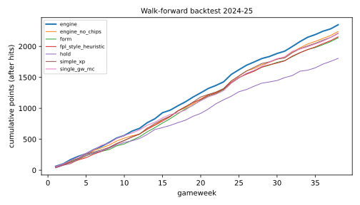
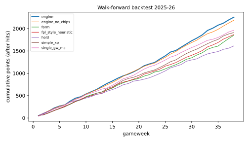

# Walk-forward backtest — decision engine vs benchmarks

Snapshot `snap_b64560a8c4f434ad984e` · optimizer `optimizer/default@1.0.0#19ba5141` · seasons 2024-25, 2025-26 · protocol `docs/BACKTEST_PROTOCOL.md` · generated by `ml/experiments/backtest.py`. All strategies start from the same GW1 squad; points are actual FPL points after hits (automatic substitutions and armband rules applied).

Strategies: **engine** (decomposed MC forecast, 5-GW MILP, paired-gain thresholds vs HOLD, chip planner); **engine_no_chips** (same, chips never played); **single_gw_mc** (same forecast, 1-GW optimiser, no thresholds); **simple_xp** (ppg × availability forecast, 1-GW optimiser); **form** (recent-form forecast, 1-GW optimiser); **fpl_style_heuristic** (approximation of an official-style heuristic, 1-GW optimiser); **hold** (no transfers, XI/captain from the MC forecast). No overall-rank claims are made: the archive has no rank distribution.

## Season totals

| season | strategy | points | hits | transfers | captain pts | bench pts | lineup regret | valid | s/decision | chips |
|---|---|---|---|---|---|---|---|---|---|---|
| 2024-25 | engine | 2371 | 8 | 57 | 359 | 368 | 378 | 100% | 31.3 | wildcard_1, bench_boost_1, free_hit_1, triple_captain_1, wildcard_2 |
| 2024-25 | single_gw_mc | 2336 | 20 | 50 | 335 | 432 | 449 | 100% | 0.1 | — |
| 2024-25 | engine_no_chips | 2313 | 4 | 32 | 351 | 415 | 409 | 100% | 26.9 | — |
| 2024-25 | fpl_style_heuristic | 2203 | 72 | 64 | 334 | 301 | 342 | 100% | 0.1 | — |
| 2024-25 | simple_xp | 2135 | 60 | 58 | 325 | 155 | 237 | 100% | 0.1 | — |
| 2024-25 | form | 2119 | 64 | 63 | 301 | 352 | 414 | 100% | 0.1 | — |
| 2024-25 | hold | 2109 | 0 | 0 | 339 | 245 | 236 | 100% | 0.0 | — |
| 2025-26 | engine | 2257 | 0 | 71 | 247 | 419 | 417 | 100% | 40.0 | bench_boost_1, wildcard_1, free_hit_1, triple_captain_1, bench_boost_2, wildcard_2, triple_captain_2, free_hit_2 |
| 2025-26 | engine_no_chips | 2189 | 8 | 36 | 275 | 330 | 365 | 100% | 17.9 | — |
| 2025-26 | single_gw_mc | 1965 | 52 | 58 | 235 | 332 | 336 | 100% | 0.1 | — |
| 2025-26 | simple_xp | 1913 | 48 | 59 | 219 | 445 | 462 | 100% | 0.2 | — |
| 2025-26 | fpl_style_heuristic | 1867 | 56 | 64 | 158 | 463 | 494 | 100% | 0.1 | — |
| 2025-26 | form | 1853 | 72 | 67 | 174 | 439 | 450 | 100% | 0.1 | — |
| 2025-26 | hold | 1614 | 0 | 0 | 204 | 149 | 248 | 100% | 0.0 | — |

## Engine minus benchmark (season points; 95 % bootstrap CI over gameweeks)

| season | vs | difference | 95 % CI | GWs better | GWs worse |
|---|---|---|---|---|---|
| 2024-25 | engine_no_chips | +58 | [-80, +201] | 21 | 16 |
| 2024-25 | form | +252 | [+91, +432] | 24 | 14 |
| 2024-25 | fpl_style_heuristic | +168 | [+6, +332] | 22 | 15 |
| 2024-25 | hold | +262 | [-5, +536] | 24 | 13 |
| 2024-25 | simple_xp | +236 | [+48, +431] | 25 | 12 |
| 2024-25 | single_gw_mc | +35 | [-118, +195] | 20 | 17 |
| 2025-26 | engine_no_chips | +68 | [-79, +222] | 24 | 13 |
| 2025-26 | form | +404 | [+159, +641] | 26 | 12 |
| 2025-26 | fpl_style_heuristic | +390 | [+177, +602] | 29 | 7 |
| 2025-26 | hold | +643 | [+407, +870] | 29 | 8 |
| 2025-26 | simple_xp | +344 | [+151, +543] | 26 | 10 |
| 2025-26 | single_gw_mc | +292 | [+123, +472] | 25 | 13 |

## Engine transfers — every one, successful and failed (hindsight diagnostic)

17 transfer weeks; realised gain over 1 GW: mean +4.29, positive in 59%; over 4 GWs: mean +13.29, positive in 76%. Realised gain = actual points of players in − players out (− hit); it ignores lineup effects and is reported as a diagnostic only.

| season | GW | out | in | hit | gain 1 GW | gain 4 GW |
|---|---|---|---|---|---|---|
| 2024-25 | 6 | De Bruyne, Diogo J., Jebbison | B.Fernandes, Mbeumo, Duran | 0 | +0 | +29 |
| 2024-25 | 8 | Harwood-Bellis, Isak | Robinson, Solanke | 0 | +1 | +1 |
| 2024-25 | 12 | Eze, Solanke, Duran | Semenyo, Isak, Evanilson | 0 | -1 | +13 |
| 2024-25 | 16 | McCarthy, Gabriel, B.Fernandes, Evanilson | Raya, Saliba, Iwobi, Solanke | 0 | -2 | +17 |
| 2024-25 | 23 | Milenković, Saliba, I.Sarr | Tarkowski, Alexander-Arnold, Rogers | 0 | +2 | +25 |
| 2024-25 | 24 | Verbruggen, Burn, Watkins | Pickford, Virgil, Wissa | 0 | +18 | +15 |
| 2024-25 | 29 | Alexander-Arnold, Iwobi, Rogers, Isak, Delap | Milenković, B.Fernandes, Kluivert, Wood, João Pedro | 0 | +28 | -18 |
| 2024-25 | 32 | Zabarnyi, Kluivert, Palmer, Wood, João Pedro | Muñoz, Barnes, I.Sarr, Isak, Mateta | 8 | +18 | +24 |
| 2025-26 | 6 | Aït-Nouri, Sarr, Eze, Wood | Chalobah, B.Fernandes, Anthony, Mateta | 0 | -11 | +3 |
| 2025-26 | 11 | Schär, Reijnders, Evanilson | Gabriel, Sarr, Kroupi.Jr | 0 | +3 | -16 |
| 2025-26 | 13 | Gabriel, M.Salah, Mateta | Lacroix, Mbeumo, Haaland | 0 | +0 | +38 |
| 2025-26 | 15 | Cucurella, Chalobah | White, Thiaw | 0 | -14 | -28 |
| 2025-26 | 16 | Burn, Sarr, Anthony | Guéhi, Szoboszlai, O.Dango | 0 | +2 | +8 |
| 2025-26 | 18 | White, Muñoz, Mbeumo, O.Dango | Virgil, J.Timber, Cunha, Stach | 0 | +8 | +62 |
| 2025-26 | 21 | Sánchez, B.Fernandes, Szoboszlai | Roefs, Rice, Enzo | 0 | -6 | -27 |
| 2025-26 | 29 | Mukiele, Bruno G., Enzo | Virgil, Garner, Szoboszlai | 0 | +12 | +40 |
| 2025-26 | 31 | J.Timber, Semenyo, Haaland, Mané | Van den Berg, Rogers, Bowen, Ekitiké | 0 | +15 | +40 |

## Diagnostics

* Plan stability: 97% of next-week plans changed when the week came. A planned *hold* was kept 50% of the time; a planned *move* was executed exactly as planned 0% of the time — future moves in a plan are provisional: each week is re-optimised on new information and must clear the paired-gain thresholds again. Mean overlap (Jaccard) of planned and executed incoming players: 10%. Round trips (player sold ≤ 3 GWs after purchase, executed actions): engine 5, engine_no_chips 6, form 11, fpl_style_heuristic 12, hold 0, simple_xp 14, single_gw_mc 13, engine 3, engine_no_chips 6, form 14, fpl_style_heuristic 12, hold 0, simple_xp 16, single_gw_mc 19.
* Engine expected vs actual squad points per GW: 57.6 vs 61.0 (corr 0.38).
* Validity: 100.0% of decisions legal under the state machine; look-ahead violations: 0 (data newer than the cutoff).

