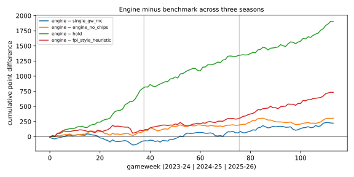
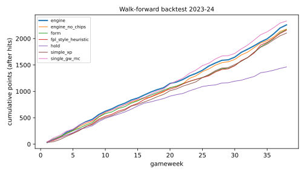

# Walk-forward backtest — three seasons

Seasons 2023-24, 2024-25, 2025-26 · snapshot `snap_b64560a8c4f434ad984e` (pinned in `config/backtest/default.yaml`) · optimizer `optimizer/default@1.0.0#19ba5141` · backtest config `backtest/default@1.0.0#aa0383ae` · feature version `1.2.0` · protocol `docs/BACKTEST_PROTOCOL.md` · generated by `ml/experiments/backtest.py --report-only` from the records in `data/eval/` (git-ignored; regenerate with the commands in the protocol).

All strategies start each season from the same GW1 squad (initial-squad optimiser on the GW1 forecast) and are replayed through all 38 gameweeks with only information available at each decision cutoff (deadline − 90 min). Points are actual FPL points after hits, with automatic substitutions and armband rules. No overall-rank claims: the archive has no distribution of other managers' scores.

> **Correction to earlier results.** The previously published report (commit `03c14a7`, archived in `ml/reports/archive/`) was produced while the fixture schedule leaked the future: archived seasons only hold the *final* schedule, so postponements (e.g. 2024-25 GW15 Everton v Liverpool, called off on match day) were visible weeks early. Schedule rule S1 (ADR-0004, `fpl_storage/schedule.py`) now shows the schedule as published at each cutoff; the 45 reconstructed moves are listed in the appendix. Every number below comes from new replays under that rule; the old numbers should not be cited.

## Season totals

| season | strategy | points | mean/GW | SD/GW | hits | transfers | captain pts | bench pts | lineup regret | valid | s/decision | chips |
|---|---|---|---|---|---|---|---|---|---|---|---|---|
| 2023-24 | single_gw_mc | 2333 | 61.4 | 21.5 | 28 | 53 | 234 | 377 | 418 | 100.0% | 0.1 | — |
| 2023-24 | engine | 2260 | 59.5 | 20.9 | 20 | 59 | 222 | 283 | 377 | 100.0% | 33.0 | wildcard_1, triple_captain_1, bench_boost_1, free_hit_1, wildcard_2 |
| 2023-24 | engine_no_chips | 2180 | 57.4 | 21.4 | 32 | 39 | 251 | 176 | 336 | 100.0% | 14.9 | — |
| 2023-24 | form | 2169 | 57.1 | 22.5 | 44 | 57 | 220 | 422 | 418 | 100.0% | 0.0 | — |
| 2023-24 | fpl_style_heuristic | 2160 | 56.8 | 23.9 | 112 | 73 | 256 | 407 | 455 | 100.0% | 0.0 | — |
| 2023-24 | simple_xp | 2104 | 55.4 | 20.1 | 36 | 55 | 218 | 380 | 465 | 100.0% | 0.1 | — |
| 2023-24 | hold | 1463 | 38.5 | 16.4 | 0 | 0 | 182 | 28 | 233 | 100.0% | 0.0 | — |
| 2024-25 | engine | 2350 | 61.8 | 18.1 | 0 | 66 | 349 | 414 | 375 | 100.0% | 27.2 | bench_boost_1, wildcard_1, free_hit_1, triple_captain_1, wildcard_2 |
| 2024-25 | engine_no_chips | 2241 | 59.0 | 21.8 | 0 | 36 | 321 | 478 | 463 | 100.0% | 23.8 | — |
| 2024-25 | single_gw_mc | 2215 | 58.3 | 18.7 | 32 | 53 | 298 | 392 | 369 | 100.0% | 0.1 | — |
| 2024-25 | simple_xp | 2210 | 58.2 | 20.8 | 48 | 57 | 307 | 195 | 243 | 100.0% | 0.1 | — |
| 2024-25 | fpl_style_heuristic | 2155 | 56.7 | 16.6 | 72 | 62 | 316 | 253 | 319 | 100.0% | 0.1 | — |
| 2024-25 | form | 2140 | 56.3 | 17.9 | 48 | 57 | 299 | 341 | 387 | 100.0% | 0.1 | — |
| 2024-25 | hold | 1807 | 47.6 | 17.1 | 0 | 0 | 175 | 292 | 341 | 100.0% | 0.0 | — |
| 2025-26 | engine | 2283 | 60.1 | 17.0 | 0 | 68 | 222 | 482 | 513 | 100.0% | 40.4 | bench_boost_1, triple_captain_1, wildcard_1, free_hit_1, bench_boost_2, triple_captain_2, wildcard_2, free_hit_2 |
| 2025-26 | engine_no_chips | 2166 | 57.0 | 12.8 | 0 | 37 | 223 | 382 | 434 | 100.0% | 17.3 | — |
| 2025-26 | single_gw_mc | 2122 | 55.8 | 15.9 | 32 | 57 | 194 | 361 | 394 | 100.0% | 0.1 | — |
| 2025-26 | simple_xp | 1953 | 51.4 | 17.2 | 56 | 63 | 227 | 471 | 468 | 100.0% | 0.1 | — |
| 2025-26 | fpl_style_heuristic | 1846 | 48.6 | 14.6 | 56 | 63 | 158 | 462 | 482 | 100.0% | 0.0 | — |
| 2025-26 | form | 1842 | 48.5 | 14.8 | 52 | 62 | 168 | 431 | 437 | 100.0% | 0.0 | — |
| 2025-26 | hold | 1718 | 45.2 | 13.0 | 0 | 0 | 186 | 202 | 280 | 100.0% | 0.0 | — |

## Aggregate over the three seasons (114 gameweeks)

| strategy | points | hits | transfers | valid |
|---|---|---|---|---|
| engine | 6893 | 20 | 193 | 100.0% |
| single_gw_mc | 6670 | 92 | 163 | 100.0% |
| engine_no_chips | 6587 | 32 | 112 | 100.0% |
| simple_xp | 6267 | 140 | 175 | 100.0% |
| fpl_style_heuristic | 6161 | 240 | 198 | 100.0% |
| form | 6151 | 144 | 176 | 100.0% |
| hold | 4988 | 0 | 0 | 100.0% |

## Engine minus benchmark (95 % bootstrap CI)

Per season: gameweeks resampled with replacement (4000 draws). `all`: season-stratified bootstrap of the 114-gameweek total. Gameweeks are treated as exchangeable, which ignores autocorrelation from shared squads (CIs are likely somewhat too narrow). 24 comparisons are shown without multiplicity correction: read single CIs that barely exclude 0 with care.

| season | vs | difference | 95 % CI | GWs better | GWs worse | verdict |
|---|---|---|---|---|---|---|
| 2023-24 | engine_no_chips | +80 | [-89, +250] | 19 | 17 | inconclusive (CI includes 0) |
| 2024-25 | engine_no_chips | +109 | [-51, +273] | 19 | 18 | inconclusive (CI includes 0) |
| 2025-26 | engine_no_chips | +117 | [-46, +276] | 23 | 13 | inconclusive (CI includes 0) |
| all | engine_no_chips | +306 | [+28, +593] | 61 | 48 | engine better (CI > 0) |
| 2023-24 | single_gw_mc | -73 | [-271, +122] | 17 | 21 | inconclusive (CI includes 0) |
| 2024-25 | single_gw_mc | +135 | [-72, +347] | 18 | 19 | inconclusive (CI includes 0) |
| 2025-26 | single_gw_mc | +161 | [-56, +367] | 22 | 14 | inconclusive (CI includes 0) |
| all | single_gw_mc | +223 | [-126, +584] | 57 | 54 | inconclusive (CI includes 0) |
| 2023-24 | simple_xp | +156 | [-62, +375] | 20 | 17 | inconclusive (CI includes 0) |
| 2024-25 | simple_xp | +140 | [-26, +304] | 22 | 16 | inconclusive (CI includes 0) |
| 2025-26 | simple_xp | +330 | [+159, +506] | 25 | 11 | engine better (CI > 0) |
| all | simple_xp | +626 | [+311, +956] | 67 | 44 | engine better (CI > 0) |
| 2023-24 | form | +91 | [-114, +312] | 19 | 19 | inconclusive (CI includes 0) |
| 2024-25 | form | +210 | [+45, +363] | 25 | 13 | engine better (CI > 0) |
| 2025-26 | form | +441 | [+222, +672] | 25 | 12 | engine better (CI > 0) |
| all | form | +742 | [+391, +1076] | 69 | 44 | engine better (CI > 0) |
| 2023-24 | fpl_style_heuristic | +100 | [-175, +355] | 18 | 18 | inconclusive (CI includes 0) |
| 2024-25 | fpl_style_heuristic | +195 | [+30, +350] | 24 | 14 | engine better (CI > 0) |
| 2025-26 | fpl_style_heuristic | +437 | [+233, +645] | 27 | 9 | engine better (CI > 0) |
| all | fpl_style_heuristic | +732 | [+369, +1094] | 69 | 41 | engine better (CI > 0) |
| 2023-24 | hold | +797 | [+544, +1069] | 33 | 3 | engine better (CI > 0) |
| 2024-25 | hold | +543 | [+263, +813] | 27 | 10 | engine better (CI > 0) |
| 2025-26 | hold | +565 | [+297, +831] | 27 | 11 | engine better (CI > 0) |
| all | hold | +1905 | [+1454, +2381] | 87 | 24 | engine better (CI > 0) |

### What changed versus the superseded (pre-S1) report

Same seasons, same strategies; the old replays could see postponements early. Verdicts that changed are in bold.

| season | vs | old difference [CI] | old verdict | new difference [CI] | new verdict |
|---|---|---|---|---|---|
| 2024-25 | engine_no_chips | +58 [-80, +201] | inconclusive (CI includes 0) | +109 [-51, +273] | inconclusive (CI includes 0) |
| 2025-26 | engine_no_chips | +68 [-79, +222] | inconclusive (CI includes 0) | +117 [-46, +276] | inconclusive (CI includes 0) |
| 2024-25 | single_gw_mc | +35 [-118, +195] | inconclusive (CI includes 0) | +135 [-72, +347] | inconclusive (CI includes 0) |
| 2025-26 | single_gw_mc | +292 [+123, +472] | **engine better (CI > 0)** | +161 [-56, +367] | **inconclusive (CI includes 0)** |
| 2024-25 | simple_xp | +236 [+48, +431] | **engine better (CI > 0)** | +140 [-26, +304] | **inconclusive (CI includes 0)** |
| 2025-26 | simple_xp | +344 [+151, +543] | engine better (CI > 0) | +330 [+159, +506] | engine better (CI > 0) |
| 2024-25 | form | +252 [+91, +432] | engine better (CI > 0) | +210 [+45, +363] | engine better (CI > 0) |
| 2025-26 | form | +404 [+159, +641] | engine better (CI > 0) | +441 [+222, +672] | engine better (CI > 0) |
| 2024-25 | fpl_style_heuristic | +168 [+6, +332] | engine better (CI > 0) | +195 [+30, +350] | engine better (CI > 0) |
| 2025-26 | fpl_style_heuristic | +390 [+177, +602] | engine better (CI > 0) | +437 [+233, +645] | engine better (CI > 0) |
| 2024-25 | hold | +262 [-5, +536] | **inconclusive (CI includes 0)** | +543 [+263, +813] | **engine better (CI > 0)** |
| 2025-26 | hold | +643 [+407, +870] | engine better (CI > 0) | +565 [+297, +831] | engine better (CI > 0) |

Engine season totals, old → new: 2024-25 2371 → 2350; 2025-26 2257 → 2283.

## Forecasts that drove the decisions (out of sample, at each cutoff)

Every player × target-gameweek forecast the replays used, joined to actual outcomes (double gameweeks summed). Integer outcomes make interval coverage discrete: *inclusive* counts p10 ≤ y ≤ p90, *strict* p10 < y < p90; a calibrated 80 % interval lies between them. Start probability = P(≥ 1 start in the gameweek).

| season | horizon | n | MAE | RMSE | bias | corr | cover incl. | cover strict | width p10–p90 | start Brier | start ECE | start base rate |
|---|---|---|---|---|---|---|---|---|---|---|---|---|
| 2023-24 | 0 | 28742 | 0.972 | 1.941 | +0.013 | 0.575 | 0.939 | 0.256 | 2.66 | 0.0803 | 0.0233 | 0.284 |
| 2023-24 | 1 | 27877 | 1.025 | 2.004 | +0.022 | 0.539 | 0.934 | 0.255 | 2.77 | 0.0989 | 0.0146 | 0.284 |
| 2023-24 | 2 | 27097 | 1.055 | 2.041 | +0.020 | 0.517 | 0.933 | 0.255 | 2.84 | 0.1108 | 0.0095 | 0.285 |
| 2023-24 | 3 | 26243 | 1.077 | 2.066 | +0.015 | 0.502 | 0.932 | 0.254 | 2.87 | 0.1182 | 0.0055 | 0.285 |
| 2023-24 | 4 | 25389 | 1.092 | 2.095 | -0.006 | 0.482 | 0.928 | 0.249 | 2.84 | 0.1232 | 0.0080 | 0.285 |
| 2024-25 | 0 | 26919 | 0.996 | 1.917 | +0.014 | 0.580 | 0.936 | 0.277 | 2.77 | 0.0865 | 0.0071 | 0.307 |
| 2024-25 | 1 | 26135 | 1.038 | 1.966 | +0.013 | 0.553 | 0.932 | 0.283 | 2.87 | 0.1038 | 0.0045 | 0.308 |
| 2024-25 | 2 | 25356 | 1.068 | 1.995 | +0.012 | 0.532 | 0.931 | 0.284 | 2.95 | 0.1137 | 0.0069 | 0.308 |
| 2024-25 | 3 | 24577 | 1.087 | 2.025 | -0.003 | 0.516 | 0.929 | 0.283 | 2.98 | 0.1204 | 0.0065 | 0.308 |
| 2024-25 | 4 | 23796 | 1.102 | 2.046 | -0.010 | 0.504 | 0.927 | 0.280 | 2.99 | 0.1251 | 0.0108 | 0.308 |
| 2025-26 | 0 | 29338 | 0.981 | 1.923 | +0.009 | 0.591 | 0.941 | 0.268 | 2.75 | 0.0775 | 0.0100 | 0.282 |
| 2025-26 | 1 | 28497 | 1.031 | 1.979 | +0.013 | 0.558 | 0.938 | 0.273 | 2.88 | 0.0957 | 0.0041 | 0.282 |
| 2025-26 | 2 | 27658 | 1.061 | 2.011 | +0.003 | 0.537 | 0.937 | 0.274 | 2.95 | 0.1063 | 0.0068 | 0.282 |
| 2025-26 | 3 | 26820 | 1.085 | 2.040 | +0.003 | 0.518 | 0.936 | 0.272 | 2.99 | 0.1132 | 0.0082 | 0.282 |
| 2025-26 | 4 | 25988 | 1.097 | 2.059 | -0.001 | 0.504 | 0.934 | 0.270 | 2.99 | 0.1177 | 0.0136 | 0.282 |

Forecast rows without an outcome row (player left the league): 5510. Start-probability Brier at horizon 0 vs a climatology (base-rate) forecast: see reliability table; climatology Brier 0.2062.

Start-probability reliability (horizon 0, all seasons):

| bin | n | predicted | observed |
|---|---|---|---|
| 0.0-0.1 | 42705 | 0.017 | 0.013 |
| 0.1-0.2 | 6819 | 0.144 | 0.118 |
| 0.2-0.3 | 4703 | 0.246 | 0.221 |
| 0.3-0.4 | 3158 | 0.347 | 0.324 |
| 0.4-0.5 | 2865 | 0.450 | 0.446 |
| 0.5-0.6 | 2999 | 0.549 | 0.553 |
| 0.6-0.7 | 3041 | 0.653 | 0.668 |
| 0.7-0.8 | 5024 | 0.757 | 0.786 |
| 0.8-0.9 | 8636 | 0.854 | 0.881 |
| 0.9-1.0 | 5049 | 0.939 | 0.940 |

Engine squad-level calibration (96 non-chip weeks): actual points inside the plan's simulated p10–p90 in 83% of weeks (below p10 5%, above p90 11%); mean expected 58.2 vs actual 60.4; correlation 0.44.

## Recommendation outcomes (engine)

| season | action | gameweeks | mean points |
|---|---|---|---|
| 2023-24 | CHIP | 5 | 65.4 |
| 2023-24 | HIT | 4 | 65.8 |
| 2023-24 | HOLD | 19 | 53.7 |
| 2023-24 | TRANSFER | 10 | 65.0 |
| 2024-25 | CHIP | 5 | 55.4 |
| 2024-25 | HOLD | 22 | 58.4 |
| 2024-25 | TRANSFER | 11 | 71.7 |
| 2025-26 | CHIP | 8 | 63.2 |
| 2025-26 | HOLD | 21 | 59.3 |
| 2025-26 | TRANSFER | 9 | 59.1 |

## Chip decisions (engine)

Direct chip points: bench points (Bench Boost) or the captain's points (the extra Triple Captain multiple). Wildcard / Free Hit value has no direct counterpart; the same-week score of `engine_no_chips` (a different squad by then) is a rough reference.

| season | GW | chip | points | direct chip points | engine_no_chips same GW |
|---|---|---|---|---|---|
| 2023-24 | 3 | wildcard_1 | 41 | — | 42 |
| 2023-24 | 4 | triple_captain_1 | 95 | 20 | 76 |
| 2023-24 | 7 | bench_boost_1 | 64 | 12 | 56 |
| 2023-24 | 11 | free_hit_1 | 46 | — | 49 |
| 2023-24 | 20 | wildcard_2 | 81 | — | 85 |
| 2024-25 | 1 | bench_boost_1 | 63 | 20 | 38 |
| 2024-25 | 2 | wildcard_1 | 40 | — | 42 |
| 2024-25 | 4 | free_hit_1 | 51 | — | 63 |
| 2024-25 | 18 | triple_captain_1 | 65 | 9 | 55 |
| 2024-25 | 23 | wildcard_2 | 58 | — | 60 |
| 2025-26 | 1 | bench_boost_1 | 68 | 18 | 60 |
| 2025-26 | 2 | triple_captain_1 | 48 | 6 | 42 |
| 2025-26 | 4 | wildcard_1 | 75 | — | 50 |
| 2025-26 | 18 | free_hit_1 | 36 | — | 40 |
| 2025-26 | 26 | bench_boost_2 | 87 | 8 | 74 |
| 2025-26 | 27 | triple_captain_2 | 38 | 2 | 32 |
| 2025-26 | 28 | wildcard_2 | 79 | — | 72 |
| 2025-26 | 34 | free_hit_2 | 75 | — | 45 |

## Engine transfers — every one, successful and failed (hindsight diagnostic)

34 transfer weeks; realised gain over 1 GW: mean +6.18, positive in 76%; over 4 GWs: mean +17.29, positive in 82%. Realised gain = actual points of players in − players out (− hit); ignores lineup effects.

| season | GW | out | in | hit | gain 1 GW | gain 4 GW |
|---|---|---|---|---|---|---|
| 2023-24 | 6 | Ødegaard, Foden | Salah, Brownhill | 0 | +0 | +11 |
| 2023-24 | 10 | Brownhill, Haaland | Saka, Watkins | 0 | -10 | -17 |
| 2023-24 | 14 | Onana, Henry | A.Becker, Tsimikas | 0 | +1 | +6 |
| 2023-24 | 16 | A.Becker | Martinez | 0 | +7 | -2 |
| 2023-24 | 17 | Mbeumo | Palmer | 0 | +14 | +33 |
| 2023-24 | 18 | Trippier, B.Fernandes | Konsa, Son | 0 | +6 | +19 |
| 2023-24 | 23 | Son, João Pedro | Gross, Toney | 0 | +5 | +39 |
| 2023-24 | 25 | Salah, Bernardo, Olise | Barkley, Diogo J., Foden | 4 | -6 | +26 |
| 2023-24 | 26 | Alexander-Arnold, Diogo J. | Senesi, Saka | 4 | +7 | +17 |
| 2023-24 | 28 | Martinez, Pinnock | Neto, Saliba | 0 | +6 | +14 |
| 2023-24 | 30 | Senesi, Barkley | Virgil, Palmer | 0 | +12 | +48 |
| 2023-24 | 33 | Aké, Foden, Toney, Watkins | Gabriel, Enzo, Isak, Haaland | 8 | +7 | +25 |
| 2023-24 | 35 | Neto, Bowen, Solanke | Vicario, B.Fernandes, N.Jackson | 4 | -5 | +22 |
| 2023-24 | 37 | Virgil, B.Fernandes | Gvardiol, Son | 0 | +25 | +28 |
| 2024-25 | 6 | Diogo J., Bruno G., Wissa | McNeil, Mbeumo, Calvert-Lewin | 0 | +16 | +30 |
| 2024-25 | 9 | Walker-Peters, Saka, Isak | Pedro Porro, Palmer, Raúl | 0 | -3 | -17 |
| 2024-25 | 11 | Eze, Calvert-Lewin | B.Fernandes, Wood | 0 | +17 | +26 |
| 2024-25 | 15 | Gabriel, McNeil, Mbeumo, Raúl | Zabarnyi, Bowen, Johnson, João Pedro | 0 | +1 | +6 |
| 2024-25 | 19 | Pedro Porro, Gvardiol, B.Fernandes, Vardy | Gabriel, Milenković, I.Sarr, Isak | 0 | +5 | +11 |
| 2024-25 | 21 | Akanji, Bowen | Robinson, Mbeumo | 0 | +8 | +15 |
| 2024-25 | 26 | Alexander-Arnold, Rogers, Amad | Muñoz, Kluivert, O.Dango | 0 | +9 | +22 |
| 2024-25 | 30 | Martinez, Tarkowski, Mykolenko, Palmer, O.Dango | Raya, Gabriel, Gvardiol, B.Fernandes, I.Sarr | 0 | -4 | +1 |
| 2024-25 | 32 | Gabriel, Kluivert | Lacroix, Barnes | 0 | +26 | +39 |
| 2024-25 | 34 | Lacroix, Stewart | Collins, Cunha | 0 | +24 | +25 |
| 2024-25 | 38 | Virgil, B.Fernandes, I.Sarr, Isak | Kiwior, Bowen, Ødegaard, Evanilson | 0 | +5 | +5 |
| 2025-26 | 3 | Palmer, Wissa | Elanga, Ekitiké | 0 | +3 | +8 |
| 2025-26 | 6 | Sarr, Ekitiké | Schade, Mateta | 0 | -5 | +15 |
| 2025-26 | 9 | Schär, Calafiori, João Pedro | Burn, Gabriel, Woltemade | 0 | +4 | -5 |
| 2025-26 | 14 | Pickford, Burn, Gabriel, Anthony, Schade | Verbruggen, Lacroix, Thiaw, B.Fernandes, Enzo | 0 | +1 | +39 |
| 2025-26 | 16 | Truffert, Enzo, Mateta | White, Szoboszlai, Thiago | 0 | +1 | -18 |
| 2025-26 | 19 | Muñoz, B.Fernandes, Gakpo, O.Dango | Collins, Rice, Cunha, Schade | 0 | +13 | +59 |
| 2025-26 | 24 | White, Collins, Szoboszlai, Cunha, Woltemade | Senesi, Gabriel, B.Fernandes, Enzo, Mané | 0 | +20 | +49 |
| 2025-26 | 32 | Kelleher, Thiaw, O.Dango, Raúl | Verbruggen, Van Hecke, Szoboszlai, Calvert-Lewin | 0 | +14 | +35 |
| 2025-26 | 36 | Verbruggen, Senesi, Rice, Semenyo | Henderson, Lacroix, Lerma, Cherki | 0 | -14 | -26 |

## Plan stability (engine)

| season | plans | next-week plan changed | planned hold kept | planned move executed exactly | incoming overlap (Jaccard) |
|---|---|---|---|---|---|
| 2023-24 | 37 | 97% | — | 3% | 13% |
| 2024-25 | 37 | 86% | 75% | 6% | 21% |
| 2025-26 | 37 | 89% | 100% | 0% | 20% |

Round trips (a player sold ≤ 3 GWs after being bought; executed actions):

| strategy | 2023-24 | 2024-25 | 2025-26 |
|---|---|---|---|
| engine | 8 | 5 | 3 |
| engine_no_chips | 6 | 1 | 1 |
| form | 10 | 7 | 12 |
| fpl_style_heuristic | 23 | 14 | 11 |
| hold | 0 | 0 | 0 |
| simple_xp | 15 | 13 | 16 |
| single_gw_mc | 15 | 14 | 17 |

## Validity, accounting and integrity checks

Decisions legal under the state machine: 100.00%; look-ahead violations (data newer than the cutoff): 0.

| check | result |
|---|---|
| every strategy has GW1-38 exactly once per season | pass |
| points = raw points - hit points | pass |
| hit points are whole multiples of the hit cost (4) | pass |
| no hits in chip weeks that make transfers free (WC/FH) | pass |
| hindsight-best lineup >= chosen lineup (same squad) | pass |
| hold strategy never transfers | pass |
| no data newer than the decision cutoff (look-ahead) | pass |
| single pinned snapshot for every record | pass |
| each chip played at most once per strategy-season | pass |

## Reproducibility

Re-running the replays from scratch reproduced 11 of 21 strategy-seasons decision-for-decision against `data/eval/run2` (an earlier full run of the same pinned inputs; differences are listed with their first gameweek and cause).

* 2023-24 engine: diverges from GW35 (points 2260 vs 2209); owned player(s) who had changed club: Palmer; the plan horizon reaches GW38 (season-end valuation fix) — rules changed between the runs
* 2023-24 engine_no_chips: diverges from GW35 (points 2180 vs 2134); owned player(s) who had changed club: Palmer; the plan horizon reaches GW38 (season-end valuation fix) — rules changed between the runs
* 2023-24 form: identical in all 38 gameweeks
* 2023-24 fpl_style_heuristic: identical in all 38 gameweeks
* 2023-24 hold: identical in all 38 gameweeks
* 2023-24 simple_xp: diverges from GW38 (points 2104 vs 2103); owned player(s) who had changed club: Palmer; the plan horizon reaches GW38 (season-end valuation fix) — rules changed between the runs
* 2023-24 single_gw_mc: identical in all 38 gameweeks
* 2024-25 engine: diverges from GW34 (points 2350 vs 2325); the plan horizon reaches GW38 (season-end valuation fix) — rules changed between the runs
* 2024-25 engine_no_chips: diverges from GW34 (points 2241 vs 2218); the plan horizon reaches GW38 (season-end valuation fix) — rules changed between the runs
* 2024-25 form: identical in all 38 gameweeks
* 2024-25 fpl_style_heuristic: identical in all 38 gameweeks
* 2024-25 hold: identical in all 38 gameweeks
* 2024-25 simple_xp: diverges from GW38 (points 2210 vs 2199); the plan horizon reaches GW38 (season-end valuation fix) — rules changed between the runs
* 2024-25 single_gw_mc: identical in all 38 gameweeks
* 2025-26 engine: diverges from GW36 (points 2283 vs 2283); owned player(s) who had changed club: Guéhi, Semenyo; the plan horizon reaches GW38 (season-end valuation fix) — rules changed between the runs
* 2025-26 engine_no_chips: diverges from GW34 (points 2166 vs 2169); owned player(s) who had changed club: Guéhi, Semenyo; the plan horizon reaches GW38 (season-end valuation fix) — rules changed between the runs
* 2025-26 form: identical in all 38 gameweeks
* 2025-26 fpl_style_heuristic: identical in all 38 gameweeks
* 2025-26 hold: identical in all 38 gameweeks
* 2025-26 simple_xp: diverges from GW38 (points 1953 vs 1948); owned player(s) who had changed club: Guéhi, Semenyo; the plan horizon reaches GW38 (season-end valuation fix) — rules changed between the runs
* 2025-26 single_gw_mc: diverges from GW38 (points 2122 vs 2120); owned player(s) who had changed club: Guéhi; the plan horizon reaches GW38 (season-end valuation fix) — rules changed between the runs

## Runtime

Wall time per season (three seasons run as parallel processes on the machine in `ml/reports/performance.md`): 2023-24: finished in 2106s; 2024-25: finished in 2229s; 2025-26: finished in 2508s.

## Appendix — schedule rule S1: fixtures moved after the schedule was published

Each fixture is shown in its original round until `known_at` (the original round's deadline, or the announcement of its new date if earlier), hidden until `announced_at`, then shown in its final gameweek. Original rounds are recovered from the final schedule by an exact, uniqueness-checked assignment (every team plays once per round).

| season | fixture | original GW | final GW | known at | announced at |
|---|---|---|---|---|---|
| 2022-23 | ARS v EVE | 7 | 25 | 2022-09-10T12:30 | 2023-02-01T19:45 |
| 2022-23 | BOU v BHA | 7 | 29 | 2022-09-10T12:30 | 2023-03-07T18:45 |
| 2022-23 | CRY v MUN | 7 | 20 | 2022-09-10T12:30 | 2022-12-21T20:00 |
| 2022-23 | FUL v CHE | 7 | 19 | 2022-09-10T12:30 | 2022-12-15T20:00 |
| 2022-23 | LEE v NFO | 7 | 29 | 2022-09-10T12:30 | 2023-03-07T18:45 |
| 2022-23 | LEI v AVL | 7 | 29 | 2022-09-10T12:30 | 2023-03-07T18:45 |
| 2022-23 | LIV v WOL | 7 | 25 | 2022-09-10T12:30 | 2023-02-01T20:00 |
| 2022-23 | MCI v TOT | 7 | 20 | 2022-09-10T12:30 | 2022-12-22T20:00 |
| 2022-23 | SOU v BRE | 7 | 27 | 2022-09-10T12:30 | 2023-02-15T19:30 |
| 2022-23 | WHU v NEW | 7 | 29 | 2022-09-10T12:30 | 2023-03-08T19:00 |
| 2022-23 | BHA v CRY | 8 | 27 | 2022-09-16T17:30 | 2023-02-15T19:30 |
| 2022-23 | CHE v LIV | 8 | 29 | 2022-09-16T17:30 | 2023-03-07T19:00 |
| 2022-23 | MUN v LEE | 8 | 22 | 2022-09-16T17:30 | 2023-01-11T20:00 |
| 2022-23 | ARS v MCI | 12 | 23 | 2022-10-18T17:00 | 2023-01-18T19:30 |
| 2022-23 | MUN v BRE | 25 | 29 | 2023-02-24T18:30 | 2023-03-08T19:00 |
| 2022-23 | NEW v BHA | 25 | 36 | 2023-02-24T18:30 | 2023-04-20T18:30 |
| 2022-23 | BHA v MUN | 28 | 34 | 2023-03-17T18:30 | 2023-04-06T19:00 |
| 2022-23 | LIV v FUL | 28 | 34 | 2023-03-17T18:30 | 2023-04-05T19:00 |
| 2022-23 | MCI v WHU | 28 | 34 | 2023-03-17T18:30 | 2023-04-05T19:00 |
| 2022-23 | BHA v MCI | 32 | 37 | 2023-04-21T17:30 | 2023-04-26T19:00 |
| 2022-23 | MUN v CHE | 32 | 37 | 2023-04-21T17:30 | 2023-04-27T19:00 |
| 2023-24 | LUT v BUR | 2 | 7 | 2023-08-18T17:15 | 2023-09-05T18:30 |
| 2023-24 | BOU v LUT | 17 | 28 | 2023-12-15T18:30 | 2024-02-14T19:30 |
| 2023-24 | MCI v BRE | 18 | 25 | 2023-12-21T18:30 | 2024-01-23T19:30 |
| 2023-24 | CHE v TOT | 26 | 35 | 2024-02-24T13:30 | 2024-04-04T18:30 |
| 2023-24 | LIV v LUT | 26 | 25 | 2024-01-24T19:30 | 2024-01-24T19:30 |
| 2023-24 | ARS v CHE | 29 | 34 | 2024-03-16T13:30 | 2024-03-26T19:00 |
| 2023-24 | BHA v MCI | 29 | 34 | 2024-03-16T13:30 | 2024-03-28T19:00 |
| 2023-24 | CRY v NEW | 29 | 34 | 2024-03-16T13:30 | 2024-03-27T19:00 |
| 2023-24 | EVE v LIV | 29 | 34 | 2024-03-16T13:30 | 2024-03-27T19:00 |
| 2023-24 | MUN v SHU | 29 | 34 | 2024-03-16T13:30 | 2024-03-27T19:00 |
| 2023-24 | WOL v BOU | 29 | 34 | 2024-03-16T13:30 | 2024-03-27T18:45 |
| 2023-24 | BHA v CHE | 34 | 37 | 2024-04-17T18:45 | 2024-04-17T18:45 |
| 2023-24 | MUN v NEW | 34 | 37 | 2024-04-17T19:00 | 2024-04-17T19:00 |
| 2023-24 | TOT v MCI | 34 | 37 | 2024-04-16T19:00 | 2024-04-16T19:00 |
| 2024-25 | EVE v LIV | 15 | 24 | 2024-12-07T13:30 | 2025-01-15T19:30 |
| 2024-25 | AVL v LIV | 29 | 25 | 2025-01-22T19:30 | 2025-01-22T19:30 |
| 2024-25 | NEW v CRY | 29 | 32 | 2025-03-15T13:30 | 2025-03-19T18:30 |
| 2024-25 | ARS v CRY | 34 | 33 | 2025-03-26T19:00 | 2025-03-26T19:00 |
| 2024-25 | MCI v AVL | 34 | 33 | 2025-03-25T19:00 | 2025-03-25T19:00 |
| 2025-26 | MCI v CRY | 31 | 36 | 2026-03-20T18:30 | 2026-04-15T19:00 |
| 2025-26 | WOL v ARS | 31 | 26 | 2026-01-21T20:00 | 2026-01-21T20:00 |
| 2025-26 | BOU v LEE | 34 | 33 | 2026-03-25T19:00 | 2026-03-25T19:00 |
| 2025-26 | BHA v CHE | 34 | 33 | 2026-03-24T19:00 | 2026-03-24T19:00 |
| 2025-26 | BUR v MCI | 34 | 33 | 2026-03-25T19:00 | 2026-03-25T19:00 |
