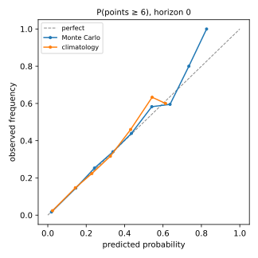
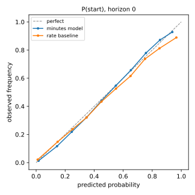
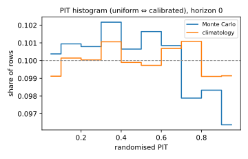

# Forecast evaluation — decomposed Monte Carlo model vs benchmarks

Snapshot `snap_b64560a8c4f434ad984e` · 114 decision cutoffs (2023-24, 2024-25, 2025-26) · horizon 5 · retrain every 4 GWs · 1000 simulations (seed 20260828) · 405,942 player × GW rows · 14 min.
Generated by `ml/experiments/forecast_eval.py`; per-row predictions in `data/eval/forecast_eval_rows.parquet`.

Gates: minutes@1.0.0 and points@1.0.0 were fixed before this evaluation; points@1.1.0 corrects one mis-specified gate after it (see *Gate history*).

Populations: *all* = every registered player with a fixture; *regulars* = recent start rate ≥ 0.5. Primary point metric: RMSE (mean-optimal); MAE favours median-like forecasts and is reported for completeness.

## Point accuracy (horizon 0)

**all**

| forecaster | n | rmse | mae | bias | spearman |
|---|---|---|---|---|---|
| mc_mean | 86021 | 1.924 | 0.984 | 0.024 | 0.706 |
| direct_lgbm | 86021 | 1.934 | 1.001 | 0.039 | 0.700 |
| ppg_availability | 86021 | 2.031 | 1.035 | 0.021 | 0.671 |
| recent_form | 86021 | 2.035 | 1.028 | 0.018 | 0.673 |
| fpl_style | 86021 | 2.053 | 0.992 | -0.076 | 0.682 |
| position_mean | 86021 | 2.351 | 1.488 | 0.043 | 0.083 |

**regulars**

| forecaster | n | rmse | mae | bias | spearman |
|---|---|---|---|---|---|
| mc_mean | 24758 | 2.955 | 2.107 | 0.004 | 0.445 |
| direct_lgbm | 24758 | 2.968 | 2.129 | 0.026 | 0.423 |
| ppg_availability | 24758 | 3.125 | 2.290 | 0.212 | 0.319 |
| recent_form | 24758 | 3.138 | 2.300 | 0.238 | 0.333 |
| fpl_style | 24758 | 3.157 | 2.278 | 0.204 | 0.361 |
| position_mean | 24758 | 3.520 | 2.146 | -1.508 | 0.105 |

## Point accuracy by horizon (RMSE, all players)

| forecaster | h0 | h1 | h2 | h3 | h4 |
|---|---|---|---|---|---|
| direct_lgbm | 1.934 | 1.985 | 2.017 | 2.048 | 2.070 |
| fpl_style | 2.053 | 2.105 | 2.142 | 2.171 | 2.193 |
| mc_mean | 1.924 | 1.978 | 2.011 | 2.038 | 2.060 |
| position_mean | 2.351 | 2.356 | 2.357 | 2.359 | 2.364 |
| ppg_availability | 2.031 | 2.068 | 2.100 | 2.127 | 2.151 |
| recent_form | 2.035 | 2.080 | 2.114 | 2.139 | 2.158 |

## Paired comparisons (bootstrap over decision cutoffs, 95% CI; negative = MC better)

| comparison | difference | 95% CI | cutoffs |
|---|---|---|---|
| all: rmse(mc_mean) - rmse(direct_lgbm) | -0.0084 | [-0.0104, -0.0063] | 114 |
| all: rmse(mc_mean) - rmse(fpl_style) | -0.1303 | [-0.1405, -0.1211] | 114 |
| all: rmse(mc_mean) - rmse(ppg_availability) | -0.0931 | [-0.1106, -0.0784] | 114 |
| all: rmse(mc_mean) - rmse(recent_form) | -0.1030 | [-0.1116, -0.0954] | 114 |
| regulars: rmse(mc_mean) - rmse(direct_lgbm) | -0.0142 | [-0.0180, -0.0104] | 114 |
| regulars: rmse(mc_mean) - rmse(fpl_style) | -0.2137 | [-0.2344, -0.1952] | 114 |
| regulars: rmse(mc_mean) - rmse(ppg_availability) | -0.1562 | [-0.1867, -0.1296] | 114 |
| regulars: rmse(mc_mean) - rmse(recent_form) | -0.1751 | [-0.1906, -0.1614] | 114 |
| all: crps(mc) - crps(climatology) | -0.0681 | [-0.0712, -0.0650] | 114 |

## Distributional quality (horizon 0)

| population | model | crps | brier_6 | log_loss_6 | ece_6 | brier_10 | coverage_80 | pit_coverage_80 | pit_coverage_50 | pit_max_dev |
|---|---|---|---|---|---|---|---|---|---|---|
| all | mc | 0.628 | 0.055 | 0.187 | 0.003 | 0.016 | 0.938 | 0.804 | 0.505 | 0.006 |
| all | climatology | 0.722 | 0.059 | 0.211 | 0.001 | 0.016 | nan | 0.800 | 0.498 | 0.002 |
| regulars | mc | 1.381 | 0.134 | 0.427 | 0.006 | 0.041 | 0.888 | 0.803 | 0.501 | 0.005 |
| regulars | climatology | 1.513 | 0.144 | 0.460 | 0.008 | 0.043 | nan | 0.793 | 0.489 | 0.008 |

## Minutes (horizon 0)

| population | model | brier_start | log_loss_start | ece_start | minutes_mae | minutes_rmse |
|---|---|---|---|---|---|---|
| all | minutes_model | 0.083 | 0.268 | 0.011 | 14.137 | 22.975 |
| all | rate_baseline | 0.101 | 0.355 | 0.021 | 15.970 | 25.507 |
| regulars | minutes_model | 0.140 | 0.445 | 0.020 | 23.877 | 30.569 |
| regulars | rate_baseline | 0.172 | 0.581 | 0.064 | 26.151 | 33.795 |

## Promotion gates — points (`models/points@1.1.0#d2ac692b`): PASSED

| gate | metric | value | target | result |
|---|---|---|---|---|
| beats_best_point_baseline_all | rmse_all_h0 | 1.9243 | <= rmse_all_h0_best_baseline +0 (= 2.03099) | pass |
| beats_best_point_baseline_regulars | rmse_regulars_h0 | 2.9554 | <= rmse_regulars_h0_best_baseline +0 (= 3.12491) | pass |
| competitive_with_direct_regressor | rmse_all_h0 | 1.9243 | <= rmse_all_h0_direct_lgbm +0.02 (= 1.95353) | pass |
| ranking_not_worse_than_baselines | spearman_all_h0 | 0.7061 | >= spearman_all_h0_best_baseline -0.01 (= 0.67164) | pass |
| crps_beats_climatology | crps_all_h0 | 0.6284 | < crps_all_h0_climatology +0 (= 0.72226) | pass |
| central_80_coverage_pit | pit_coverage_80_all_h0 | 0.8035 | in [0.77, 0.83] | pass |
| haul_probability_calibrated | ece_6_all_h0 | 0.0031 | <= 0.02 | pass |

## Promotion gates — minutes (`models/minutes@1.0.0#8df02161`): PASSED

| gate | metric | value | target | result |
|---|---|---|---|---|
| start_brier_beats_rate_baseline | brier_start_all_h0 | 0.0826 | < brier_start_all_h0_rate_baseline +0 (= 0.10145) | pass |
| start_log_loss_beats_rate_baseline | log_loss_start_all_h0 | 0.2679 | < log_loss_start_all_h0_rate_baseline +0 (= 0.35493) | pass |
| start_probability_calibrated | ece_start_all_h0 | 0.0108 | <= 0.03 | pass |
| minutes_mae_beats_rate_baseline | minutes_mae_all_h0 | 14.1372 | < minutes_mae_all_h0_rate_baseline +0 (= 15.96957) | pass |

## Gate history (superseded versions on this evaluation)

- `models/points@1.0.0#10df3bc6`: FAILED — interval_80_coverage = 0.9382 (target in [0.75, 0.9]). inclusive [p10, p90] over-covers integer outcomes (40% of rows have p10 = p90); randomised-PIT central coverage 0.803 → mis-specified gate, replaced in 1.1.0.

## Figures

