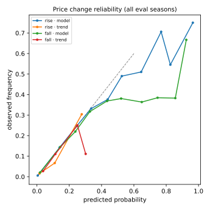

# Price-change model — walk-forward evaluation

Snapshot `snap_b64560a8c4f434ad984e` · decision GWs ≥ 3 of 2023-24, 2024-25, 2025-26 · retrain every 5 GWs · 76,516 player × GW predictions.
Target: direction of price(t+1) − price(t). Information set: GW rows ≤ t−1 only (the archive is gameweek-granular, so last-week transfer momentum is not observable — see limitations). Generated by `ml/experiments/price_change_eval.py`.

| season | event | model | n | event rate | Brier | log loss | ECE | AUC |
|---|---|---|---|---|---|---|---|---|
| 2023-24 | rise | lgbm_calibrated | 25577 | 0.0212 | 0.01703 | 0.0620 | 0.0021 | 0.950 |
| 2023-24 | rise | trend_baseline | 25577 | 0.0212 | 0.01913 | 0.0846 | 0.0015 | 0.800 |
| 2023-24 | rise | base_rate | 25577 | 0.0212 | 0.02075 | 0.1029 | 0.0017 | 0.472 |
| 2023-24 | fall | lgbm_calibrated | 25577 | 0.0442 | 0.04003 | 0.1502 | 0.0102 | 0.851 |
| 2023-24 | fall | trend_baseline | 25577 | 0.0442 | 0.04051 | 0.1666 | 0.0162 | 0.739 |
| 2023-24 | fall | base_rate | 25577 | 0.0442 | 0.04264 | 0.1846 | 0.0189 | 0.513 |
| 2024-25 | rise | lgbm_calibrated | 24380 | 0.0215 | 0.01697 | 0.0598 | 0.0016 | 0.957 |
| 2024-25 | rise | trend_baseline | 24380 | 0.0215 | 0.01928 | 0.0867 | 0.0008 | 0.778 |
| 2024-25 | rise | base_rate | 24380 | 0.0215 | 0.02107 | 0.1040 | 0.0010 | 0.458 |
| 2024-25 | fall | lgbm_calibrated | 24380 | 0.0500 | 0.04131 | 0.1512 | 0.0037 | 0.866 |
| 2024-25 | fall | trend_baseline | 24380 | 0.0500 | 0.04493 | 0.1795 | 0.0089 | 0.737 |
| 2024-25 | fall | base_rate | 24380 | 0.0500 | 0.04764 | 0.1996 | 0.0074 | 0.472 |
| 2025-26 | rise | lgbm_calibrated | 26559 | 0.0201 | 0.01576 | 0.0546 | 0.0011 | 0.963 |
| 2025-26 | rise | trend_baseline | 26559 | 0.0201 | 0.01789 | 0.0798 | 0.0012 | 0.803 |
| 2025-26 | rise | base_rate | 26559 | 0.0201 | 0.01970 | 0.0985 | 0.0005 | 0.489 |
| 2025-26 | fall | lgbm_calibrated | 26559 | 0.0510 | 0.04180 | 0.1520 | 0.0055 | 0.871 |
| 2025-26 | fall | trend_baseline | 26559 | 0.0510 | 0.04583 | 0.1826 | 0.0062 | 0.726 |
| 2025-26 | fall | base_rate | 26559 | 0.0510 | 0.04847 | 0.2022 | 0.0061 | 0.439 |
| all | rise | lgbm_calibrated | 76516 | 0.0209 | 0.01657 | 0.0587 | 0.0012 | 0.957 |
| all | rise | trend_baseline | 76516 | 0.0209 | 0.01875 | 0.0836 | 0.0005 | 0.792 |
| all | rise | base_rate | 76516 | 0.0209 | 0.02049 | 0.1017 | 0.0007 | 0.478 |
| all | fall | lgbm_calibrated | 76516 | 0.0484 | 0.04105 | 0.1511 | 0.0047 | 0.863 |
| all | fall | trend_baseline | 76516 | 0.0484 | 0.04376 | 0.1763 | 0.0093 | 0.733 |
| all | fall | base_rate | 76516 | 0.0484 | 0.04626 | 0.1955 | 0.0108 | 0.479 |

